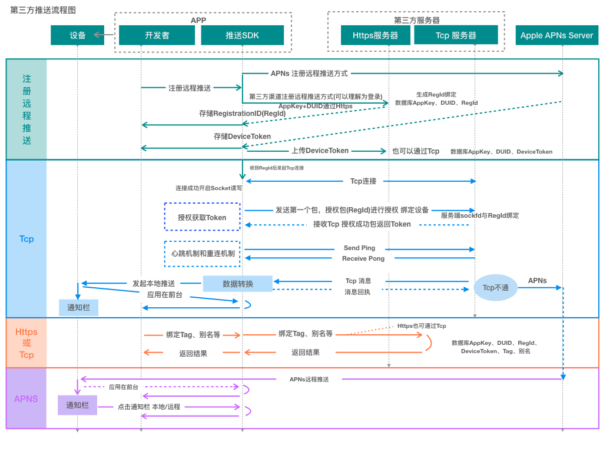

# iOS推送消息架构整合方案（O2SPushKit），兼容新旧系统及统一API
**前言**
> iOS 10 开始推送可以使用独立的UserNotifications.framework来管理和使用 iOS 系统中通知功能。如果想要在老系统 iOS 3 ~ iOS 10 中使用推送，UserNotifications.framework框架在iOS 10之后出现，系统中不含有此动态库，因此开发者还需写一套兼容旧的API(当然市面上iOS 10 之前版本用户占比非常之少，将其整合，也算是对苹果推送系统熟悉及发展历史了解)。  
> 
> 目的：将 iOS 10 之前老版本杂乱的API及之后新版本UserNotifications架构整合,输出Framework架构包
>

开源项目地址：[github](https://github.com/o2space/O2SPushKit.git) ，近几年一直在做SDK业务开发工作，比较习惯的项目结构。工程内部通过独立创建Aggregate的Target添加脚本来实现framework不同架构合并并保存至项目相关目录，有利于后期的Jinken或者gitlab的CI/CD自动化。可以选择 **Mach-O Type**为**Relocatable Object File**或者**Static Library**制作SDK,具体区别可以网上搜索资料(这里制作的framework包内部使用了**分类 Category**,为了避免要求应用在集成时Other Linker Flags内添加-ObjC,这里选择**Relocatable Object File**),详情下载工程。  

### 一、集成步骤

通过Cocoapods集成

```
//在 Podfile 文件中添加命令：
pod 'O2SPushKit'
```

### 二、使用说明

**注册远程通知并配置权限及categories**

```
// 引入SDK
#import <O2SPushKit/O2SPushKit.h>

// 注册远程通知并配置权限及categories(nullable)
O2SPushNotificationConfiguration *config = [[O2SPushNotificationConfiguration alloc] init];
config.types = O2SPushAuthorizationOptionBadge | O2SPushAuthorizationOptionSound | O2SPushAuthorizationOptionAlert;
config.categories = [self registerNotificationCategory];
[O2SPushCenter registerForRemoteNotification:config];

// 设置应用在前台时收到推送通知是否展示通知横幅、角标、声音(iOS10以后有效，iOS10之前不展示)
[O2SPushCenter setupForegroundNotificationOptions:(O2SPushAuthorizationOptionBadge | O2SPushAuthorizationOptionSound | O2SPushAuthorizationOptionAlert)];

```

**categories配置方式，举个栗子：**
>使用O2SPushNotificationCategory、O2SPushNotificationAction内部根据系统版本号，分发兼容老版UIMutableUserNotificationCategory、UIMutableUserNotificationAction，新版UNNotificationAction(或UNTextInputNotificationAction)、UNNotificationCategory，无需要写两套。

```
// Category
- (id) registerNotificationCategory
{
    // Action
    O2SPushNotificationAction *inputAction = [O2SPushNotificationAction textInputActionWithIdentifier:@"action.input"
                                                                                                title:@"Input"
                                                                                              options:O2SPushNotificationActionOptionNone
                                                                                 textInputButtonTitle:@"Send Say"
                                                                                 textInputPlaceholder:@"What do you want to say..."];
    
    O2SPushNotificationAction *goodbyeAction = [O2SPushNotificationAction defaultActionWithIdentifier:@"action.goodbye"
                                                                                                title:@"Goodbye"
                                                                                              options:O2SPushNotificationActionOptionForeground];
    
    O2SPushNotificationAction *cancelAction = [O2SPushNotificationAction defaultActionWithIdentifier:@"action.cancel"
                                                                                                title:@"Cancel"
                                                                                              options:O2SPushNotificationActionOptionDestructive];
    
    // Category
    O2SPushNotificationCategory *doSomethingCategory = [O2SPushNotificationCategory categoryWithIdentifier:@"doSomethingCategory"
                                                                                                   actions:@[inputAction, goodbyeAction, cancelAction]
                                                                                         intentIdentifiers:@[]
                                                                             hiddenPreviewsBodyPlaceholder:nil //@"新的消息"
                                                                                     categorySummaryFormat:nil //@"还有%u条来自%@的消息"
                                                                                                   options:O2SPushNotificationCategoryOptionCustomDismissAction];
    return [NSSet setWithObjects:doSomethingCategory, nil];
    
}  

```

#### 统一"推送消息接收"API:

**通过 “通知中心” 接收“推送消息”,整合 iOS 3 ~ iOS 10 和 iOS 10 以上统一API输出:**
>
>

```
// 推送消息接收
[[NSNotificationCenter defaultCenter] addObserver:self selector:@selector(o2spush_didReceiveMessageNotification:) name:O2SPushDidReceiveMessageNotification object:nil];
```

**“推送消息”触达,目前的所有系统版本(包含 iOS 3 ~ iOS 10 )**
>消息类型分成4种：   
>
>* 1.在前台接收远程通知(包含静默推送，其前后台都能收到)  
>* 2.在前台接收本地通知   
>* 3.通知栏内点击远程通知(默认点击及自定义Category-Action)  
>* 4.通知栏内点击本地通知(默认点击及自定义Category-Action)  
>
>

```
- (void)o2spush_didReceiveMessageNotification:(NSNotification *)notification
{
    O2SPushNotificationMessage *message = notification.object;
    if ([message isKindOfClass:O2SPushNotificationMessage.class])
    {
        NSLog(@"\n =============== message:\n%@\n =============== \n",message.convertDictionary);
        
        NSMutableString *title = [NSMutableString string];
        [title appendString:@"收到通知类型："];
        switch (message.notificationMessageType)
        {
            case O2SPushNotificationMessageTypeAPNs:
            {
                //远程推送消息
                if (message.content.silentPush)
                {
                    [title appendString:@"远程通知-静默推送"];
                }
                else
                {
                    [title appendString:@"远程通知"];
                }
            }
                break;
            case O2SPushNotificationMessageTypeLocal:
            {
                //本地推送消息
                [title appendString:@"本地通知"];
            }
                break;
            case O2SPushNotificationMessageTypeAPNsClicked:
            {
                //通知栏 远程推送点击
                if (message.content.actionIdentifier && ![message.content.actionIdentifier isEqualToString:@"com.apple.UNNotificationDefaultActionIdentifier"])//自定义按钮触发
                {
                    [title appendString:@"远程通知-通知栏点击-自定义按钮"];
                    [title appendFormat:@"\n Category:%@", message.content.category];
                    [title appendFormat:@"\n Action:%@", message.content.actionIdentifier];
                    if (message.content.actionUserText)
                    {
                        [title appendFormat:@"\n UserText:%@", message.content.actionUserText];
                    }
                }
                else
                {
                    [title appendString:@"远程通知-通知栏点击"];
                }
                
            }
                break;
            case O2SPushNotificationMessageTypeLocalClicked:
            {
                //通知栏 本地推送点击
                if (message.content.actionIdentifier && ![message.content.actionIdentifier isEqualToString:@"com.apple.UNNotificationDefaultActionIdentifier"])//自定义按钮触发
                {
                    // mess
                    [title appendString:@"本地通知-通知栏点击-自定义按钮"];
                    [title appendFormat:@"\n Category:%@", message.content.category];
                    [title appendFormat:@"\n Action:%@", message.content.actionIdentifier];
                    if (message.content.actionUserText)
                    {
                        [title appendFormat:@"\n UserText:%@", message.content.actionUserText];
                    }
                }
                else
                {
                    [title appendString:@"本地通知-通知栏点击"];
                }
            }
                break;
            default:
                break;
        }
    }
}
```

**注册APNS远程推送结果：通过 “通知中心” 获取**

```
//注册监听
[[NSNotificationCenter defaultCenter] addObserver:self selector:@selector(o2spush_didRegisterRemoteNotification:) name:O2SPushDidRegisterRemoteNotification object:nil];
[[NSNotificationCenter defaultCenter] addObserver:self selector:@selector(o2spush_failedRegisterRemoteNotification:) name:O2SPushFailedRegisterRemoteNotification object:nil];

//成功
- (void)o2spush_didRegisterRemoteNotification:(NSNotification *)notification
{
    NSString *deviceTokenStr = notification.userInfo[@"deviceToken"];//或 NSData *deviceTokenData = notification.object;
    NSLog(@"deviceToken:%@",deviceTokenStr);
}

//失败
- (void)o2spush_failedRegisterRemoteNotification:(NSNotification *)notification
{
    NSError *error = notification.object;
    if ([error isKindOfClass:NSError.class])
    {
        NSLog(@"%@",error);
    }
}

```

#### O2SPushCenter类中其他接口：  
**本地通知**

```
/// 添加本地推送通知
/// 注意：iOS10及以上发送相同推送标识(identifier) 通知栏上旧通知将被覆盖(包括远程推送)
/// @param request 推送通知请求体(通知标识、通知具体信息、触发方式)
/// @param handler 回调添加结果，result值：
///         iOS10及以上成功：result为UNNotificationRequest对象
///         iOS10以下成功：result为UILocalNotification对象
///         失败：result为nil
+ (void)addLocalNotification:(O2SPushNotificationRequest *)request
                     handler:(void (^) (id result, NSError *error))handler;
                     
/// 删除指定的推送通知
/// @param identifiers 推送请求标识数组，为nil时删除该类型所有通知
/// @param requestStatuses  三种值：
///         O2SPushNotificationRequestStatusPending：待发送 例如定时推送，未触发的推送
///         O2SPushNotificationRequestStatusDelivered：已经发送且在通知栏里的推送(包括本地推送和远程推送)
///         以上两种都包含：O2SPushNotificationRequestStatusPending | O2SPushNotificationRequestStatusDelivered
+ (void)removeNotificationWithIdentifiers:(NSArray<NSString *> *)identifiers
                          requestStatuses:(O2SPushNotificationRequestStatusOptions)requestStatuses;


/// 查找推送通知
/// @param identifiers 推送请求标识数组，为nil或空数组时则返回相应类型下所有在通知中心显示推送通知或待推送通知
/// @param requestStatus 两种值：
///         O2SPushNotificationRequestStatusPending：待发送 例如定时推送，未触发的推送
///         O2SPushNotificationRequestStatusDelivered：已经发送且在通知栏里的推送(包括本地推送和远程推送)，iOS10以下查询结果为nil
///         注意：使用(O2SPushNotificationRequestStatusPending | O2SPushNotificationRequestStatusDelivered)以O2SPushNotificationRequestStatusDelivered处理
/// @param handler 回调查找结果，result值：
///         iOS10以下：返回UILocalNotification对象数组
///         iOS10及以上：
+ (void)findNotificationWithIdentifiers:(NSArray<NSString *> *)identifiers
                          requestStatus:(O2SPushNotificationRequestStatusOptions)requestStatus
                                handler:(void (^) (NSArray *result, NSError *error))handler;
                        
                                
/// 跳转至系统设置应用权限页面，iOS8及以上有效
/// @param handler 返回跳转结果
+ (void)openSettingsForNotification:(void(^)(BOOL success))handler;                                
    
```

**应用角标**

```
/// 设置应用角标
/// 此处特殊处理当赋0值时不清空通知栏
/// 注意： 清空角标的同时清空通知栏：
///             [UIApplication sharedApplication].applicationIconBadgeNumber =  0;
///      只清空角标不清空通知栏:
///             iOS11及以上，[UIApplication sharedApplication].applicationIconBadgeNumber =  -1;
///             iOS10及以上至iOS11(不含)，无法做到
///             iOS10以下：发起一个本地通知，前台收到“清空角标标识”的本地通知过滤即可:
///                 UILocalNotification *localNotification = [UILocalNotification new];
///                 localNotification.fireDate = NSDate.date;
///                 localNotification.applicationIconBadgeNumber = -1;
///                 localNotification.userInfo = @{@"清空角标标识": @(YES)};//用户本地收到时过滤
///                 [UIApplication.sharedApplication scheduleLocalNotification:localNotification];
/// @param badge 角标数值
+ (void)setBadge:(NSInteger)badge;

/// 清空角标，但不清空通知栏消息(除iOS10~iOS11(不含)外，其通知栏将会一起清除)
+ (void)clearBadge;

/// 清空角标，及清空通知栏消息
/// [UIApplication sharedApplication].applicationIconBadgeNumber =  0;
+ (void)clearNoticeBar;

```


### 以上就是整个 O2SPushKit.framework 集成及使用

### 下列为开发 O2SPushKit 逻辑和其中遇到的问题及解决

### 三、实现逻辑
>hook时机：总之在main函数执行之前  
>1、可以在Class loade方法中，  
>2、亦可静态数据初始化  
>2、亦可使用__attribute__((constructor)) 修饰一个C的静态函数 在main函数之前执行  
>  

1、hook 系统 **UIApplication** 类的 **setDelegate:** 方法，目的将Set的值保存起来并回调原始方法，

* 保存的值用于Hook与其推送相关的**\<UIApplicationDelegate\>对象**代理方法或者往此对象中添加推送相关缺少的方法。

```	
  //ios3及以上 注册远程推送成功回调返回deviceToken
  application:didRegisterForRemoteNotificationsWithDeviceToken: 
  
  //ios3及以上 注册远程推送失败回调
  application:didFailToRegisterForRemoteNotificationsWithError: 
```

* iOS10以下，推送消息走**UIApplicationDelegate**代理方法,如：

```
  //ios3-ios10 远程推送  
  application:didReceiveRemoteNotification: 
  
  //ios4-ios10 本地推送  
  application:didReceiveLocalNotification:  
  
  //ios7-ios10远程推送 及 ios7及以上远程静默推送  
  application:didReceiveRemoteNotification:fetchCompletionHandler: 
  
  //ios8-ios10 本地通知 通知栏通知按钮，用户注册的categories和action点击触发 
  application:handleActionWithIdentifier:forLocalNotification:completionHandler:  
  
  //ios9-ios10 本地通知 通知栏通知按钮，用户注册的categories和action点击触发包含(input 输入)  
  application:handleActionWithIdentifier:forLocalNotification:withResponseInfo:completionHandler:
  
  //ios8-ios10 远程通知 通知栏通知按钮，用户注册的categories和action点击触发   
  application:handleActionWithIdentifier:forRemoteNotification:completionHandler: 
  
  //ios9-ios10 远程通知 通知栏通知按钮，用户注册的categories和action点击触发包含(input 输入)
  application:handleActionWithIdentifier:forRemoteNotification:withResponseInfo:completionHandler: 
	
```  

2、iOS10以上，hook **UNUserNotificationCenter**类的 **setDelegate:** 方法  

* 如果用户调用此方法将Set的值保存起来，使用**[O2SPushContext currentContext]**内定且收到推送消息后，派发回去调用之前Set保存的对象的方法  
* 如果用户不主动调用，内部也会自动内定，收到推送消息 

3、将无论是 iOS 10 以下或以上，收到的本地通知、远程通知以及点击通知栏通知都统一通过**“通知中心”**进行消息传递，同时将hook的推送消息接收相关方法进行派发回原始方法

问题1：iOS10及以上，应用自身代码使用了iOS10以下的推送，接收方法是否能收到(由于**O2SPushKit**内部主动使用了新版推送)。  
解决：跨体系派发，**O2SPushKit**收到推送，广播出去的同时，如果用户实现了**UIApplicationDelegate**的代理方法接收推送，那么内部需要将推送消息数据转换发送给此方法  
问题2：iOS10以下，应用被杀死，无法收到通知栏被点击的本地通知(远程通知可以收到)  
解决：实际上此**“application:didFinishLaunchingWithOptions:”**方法**launchOptions**参数里面已经带有被点击的推送消息。获取方式：

```
id localNoti = launchOptions[UIApplicationLaunchOptionsLocalNotificationKey];
id remoteNoti = launchOptions[UIApplicationLaunchOptionsRemoteNotificationKey];
```

**O2SPushKit**内部解决方式：

```
[[NSNotificationCenter defaultCenter] addObserver:self
                                         selector:@selector(applicationDidFinishLaunching:)
                                             name:UIApplicationDidFinishLaunchingNotification
                                           object:nil];
                                          
- (void)applicationDidFinishLaunching:(NSNotification *)notification
{
	if (notification.userInfo && 系统版本<10.0)
	{
		id localNoti = notification.userInfo[UIApplicationLaunchOptionsLocalNotificationKey];
		if (localNoti && [localNoti isKindOfClass:UILocalNotification.class])
		{
			广播本地推送消息
		}
	}
}
```

#### O2SPushKit 内部使用UNUserNotification的时候用runtime的objc\_msgSend进行调用，其实没必要这么处理，只需要Xcode版本含新版推送动态库，使用的时候进行系统版本判断即可。当然一开始已经通过objc\_msgSend调用，后面都统一以此方式调用。


### 四、其他探讨，下列与第三方推送相关
> 第三方推送比如：极光、MobPush、友盟、个推等几家，又有哪些功能。  
> 1、多了个远程推送渠道，APNS是苹果的远程推送渠道，他们增加的就是SDK内部与其服务端进行TCP长连接,通过Socket发送消息，SDK内部收到消息并发起本地推送，一般这种应用内推送需要在前台，应用至后台后，第三方推送会将新的消息发送至**Apple APNs Server**。  
> 2、一些额外功能，将设备进行绑定比如：DeviceToken(苹果推送设备标识)、别名、标签、手机，除了DeviceToken上传是主动行为，其他是用户行为。用户通过第三方开放Api接口(通过别名，标签，或者RegId)精准或群推送。    
> 3、消息撤销：这里的撤销是在通知栏上或系统定时未发送的消息，且iOS10以上、应用未被用户手动杀死，通过iOS提供API删除通知(UNUserNotificationCenter下的removePendingNotificationRequestsWithIdentifiers、removeDeliveredNotificationsWithIdentifiers、removeAllPendingNotificationRequests、removeAllDeliveredNotifications)。那么第三方是如何做的呢：  
>
>* 应用在后台使用APNs渠道：发送一个静默推送，userinfo携带撤销消息命令及需要撤销的identifiers，然后执行上方提供的API  
>* 应用在前台使用Tcp渠道：接收Socket消息，根据消息命令及消息内容携带的identifiers，执行上方提供的API
> 
> 4、消息替换：iOS10以上发送相同的identifier推送即可
> 

**简单架构：**

```
      User(App developer/运营人员)
          |
          |                                        
  +-------|------Push Server------------+  
  |       v                             |         
  |  +-----------------+  +-----------+ |         +-------------------+
  |  |  Open ApiServer |->| Msg Center|---------->| Apple APNs Server |
  |  +-----------------+  +-----------+ |   ^     +-------------------+
  |                            |        |   |              |
  |                            V        |   |              |
  | +--------------+    +-----------+   |   |              |  
  | | Https Server |----| TCP Server|------>/              |
  | +--------------+    +-----------+   |                  | 
  |        |                  ^         |                  v 
  +--------|------------------|---------+        +------iPhone------+
           |                  |                  |         ^        |
           |                  |                  |         |        |
           |                  |                  |         |        |
           |                  |                  |         |        |
           |                  |                  |         |        |
           |                  |                  |         |        |
           |                  |                  |   +----------+   |
           \-------------------\-------------------->|    SDK   |   |
                                                 |   +----------+   |
                                                 |                  |
                                                 |                  |                                         
                                                 |                  |
                                                 +------------------+


```

**献上流程图：**



### 结束
